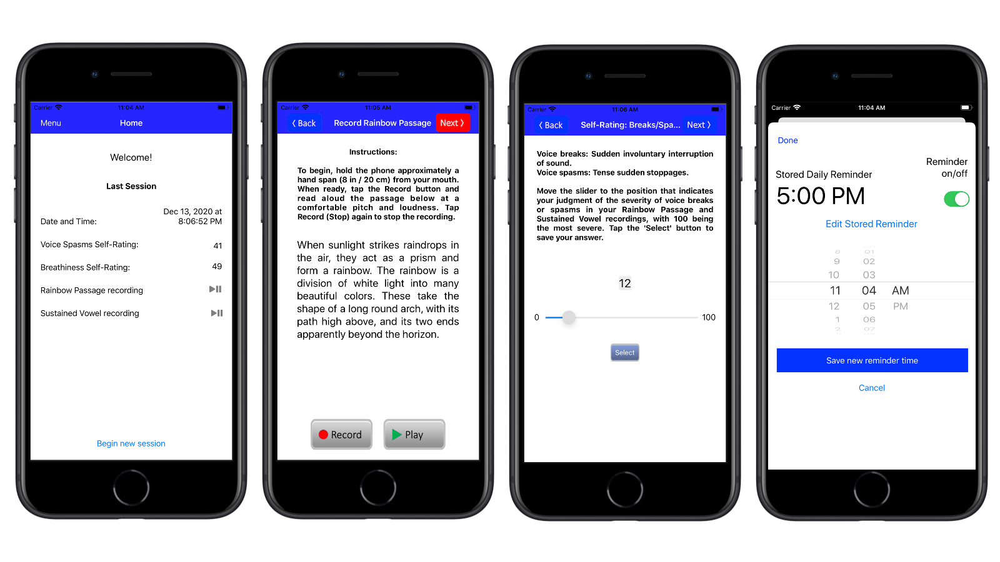

<html>
	<head>
		<meta charset="UTF-8" />
		<meta name="viewport" content="width=device-width, initial-scale=1, maximum-scale=1, user-scalable=no" />
		<meta http-equiv="X-UA-Compatible" content="IE=edge" />

		<title>MyVoice App</title>
	</head>
	<body>

	

			<h1>MyVoice App</h1>
	

<h3>MyVoice - Voice Recorder and Self-Rating Log</h3>

There is a need for persons receiving voice therapy to keep track of voice quality each day between therapy sessions. With this app users can self-rate their voice and log their ratings daily, using a protocol adapted from the National Spasmodic Dysphonia Association (NSDA).
 

The app is also designed to allow users to easily record voice samples each day. The recordings and self-ratings log file can be sent to your email account using a built-in send email feature, to access them by computer.

Additional features and functionality include the ability to set and store a daily reminder to start a session,  and a spreadsheet view of the log file of all your stored  results.

For more information, please contact Peter S. Popolo by email at peterpopolo@gmail.com

	

		
	

	

		<a href="https://apps.apple.com/us/app/myvoice-self-rating-log/			id1548589082">
		</img></a>
	

<h3>Mobile App Privacy Policy</h3>

Click to view Mobile App Privacy Policy: <a href="privacy.pdf">Privacy Policy</a>

