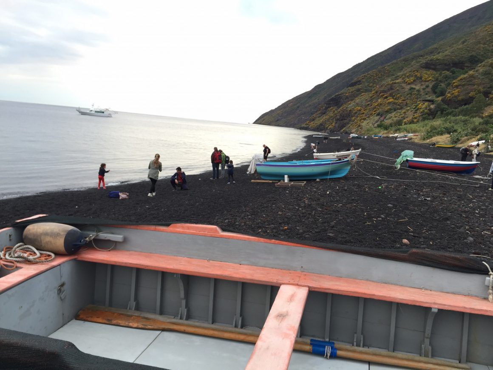

<html>
	<head>
		<meta charset="UTF-8" />
		<meta name="viewport" content="width=device-width, initial-scale=1, maximum-scale=1, user-scalable=no" />
		<meta http-equiv="X-UA-Compatible" content="IE=edge" />

		<title>Digital Health Applications</title>
	</head>
	<body>
	

	

			<h1>Digital Health Applications</h1>
	

	
	
<a href="./">Home</a>
	&nbsp;&nbsp;
	<a href="./latest.html">Apps</a>
	&nbsp;&nbsp;
	<a href="./tutoring.html">Tutoring</a>
	&nbsp;&nbsp;
	<a href="./about.html">About</a>
	&nbsp;&nbsp;
	<a href="./blog.html">Blog</a>
	&nbsp;&nbsp;
	<a href="./contactInfo.html">Contact</a>

	
	

	
  			
  			
<small>&#169; 2021 Peter S. Popolo</small>

	

	

			<h2>About Digitalhealthapplications.com</h2>
	

SIMPLY PUT, what I offer is the ability to create your iPhone app, from concept to App Store acceptance, in a rapid-turnaround timeframe, to support your allied health-related evidence-based clinical research project. I typically charge around $6000 to deliver your App-Store-published and downloadable app in just about 5 weeks, on average, for a moderate-complexity app with up to six separate text-based or static-image user-interface screens (scenes) and basic features. Apps with more than 6 scenes, or that have animations and complicated graphic interfaces, advanced feature sets, or that implement complex algorithms or require significant computing or storage resources, are competitively priced upward from that basic starting point and require longer turnaround times.

Beginning in 2021, I also offer individual tutoring in the STEM (Science, Technology, Engineering, Math) subjects and standardized test prep, via online teleconferencing  applications (such as zoom). I specialize in Human Anatomy & Physiology, Neuroscience, Physics for the Health Sciences (as well as for Engineering majors), Calculus, Linear Algebra, and preparation in GRE (Quantitative and Verbal Reasoning), PSAT, SAT, SAT Subject Tests in the Math Level I, Math Level II, and Physics areas, and Praxis exams for allied health careers. Because I don't work for test prep companies, don't travel, and don't need to rent classroom space, I am able to offer extremely competitive hourly rates and packages - AND during the COVID resctictions, online tutoring is the way to go! <a href="./tutoring.html">(go to Tutoring)</a>

And, I am available to do live (and virtual) speaking and instruction sessions, in design and technology as it relates to speech, voice, and hearing science. Book me to speak to your group today!

	

	

			<h1>About me</h1>
		
		
<small>&#169; 2021 Peter S. Popolo</small>

	

	

		 <h1>Peter S. Popolo, Ph.D.</h1>
			<h2>Digital health technical consulting services</h2>
	

As a product manager, software developer, and voice researcher, I bring a focused mix of industry, research, and academic experience and a strong set of transferable skills to the bioinstrumentation field and medical device industry. I have a history of product development and product management successes, from conceptual design through launch, in the areas of speech & voice acoustics, videolaryngoscopic imaging, and electronic health record (EHR) systems. I am highly skilled in Matlab programming for rapid prototyping and testing of complex algorithms, and I am a self-taught iOS app developer using Swiift to create iPhone apps that support evidence-based clinical practice. I am passionate about user experience/user interface (UX/UI) design and user research, and I am also an experienced university instructor (online & in-person) at the graduate and undergraduate levels. 
 

Contact <a href="mailto:peterpopolo@gmail.com?subject=Contact"> Peter S. Popolo</a>

<a href="./">Home</a>

  
<small>&#169; 2021 Peter S. Popolo. All rights reserved.</small>

