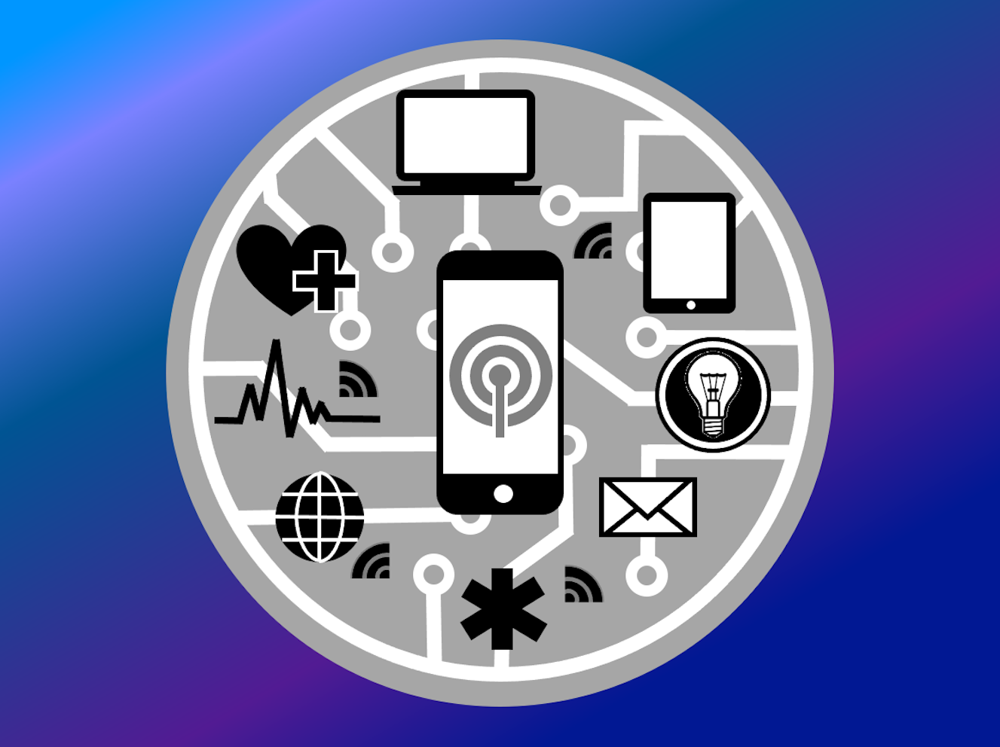

<html>
	<head>
		<meta charset="UTF-8" />
		<meta name="viewport" content="width=device-width, initial-scale=1, maximum-scale=1, user-scalable=no" />
		<meta http-equiv="X-UA-Compatible" content="IE=edge" />

		<title>Digital Health Applications</title>
	</head>
	<body>
	

	

			<h1>Digital Health Applications</h1>
	

	
	
<a href="./">Home</a>
	&nbsp;&nbsp;
	<a href="./latest.html">Apps</a>
	&nbsp;&nbsp;
	<a href="./tutoring.html">Tutoring</a>
	&nbsp;&nbsp;
	<a href="./about.html">About</a>
	&nbsp;&nbsp;
	<a href="./latest_blog.html">Blog</a>
	&nbsp;&nbsp;
	<a href="./contactInfo.html">Contact</a>

	
	

	
  			
  			
<small>&#169; 2021 Peter S. Popolo</small>

	

	

			<h2>An amazing array of sensors at your fingertips</h2>
	

Today’s smartphone puts an amazing array of sophisticated sensors right in the palm of every user’s hand. These include HD camera, microphone, ambient light sensor, accelerometer, magnetometer, gyroscope, pressure sensor, touch sensor, fingerprint reader, and GPS receiver, just to name few. Some of the health-monitoring capabilities that arise from this vast array include cardiovascular, pulmonary, ophthalmic, dermatologic, activity and sleep monitoring, and audiometric and hearing impairment monitoring applications. With the addition of external sensor accessories, applications such as ambulatory EKG, blood-glucose level, and vocal fold vibration sensing become possible as well. 

According to a 2018 online source, more than 300K health apps are currently available (even more in 2021!), and over 60% of smartphone users downloaded at least one health app and used it daily. As gleaned from the list of sensors in the above paragraph, health apps are being used to monitor anything from pulse rate, to balance and falls for the elderly, to disease progress such as rheumatoid arthritis (RA) and age-related macular degeneration (AMD), and even COVID-related monitoring such as cough detection and vocal strain due to videoconferencing.

The original logo I designed for Digital Health Applications back in 2017, shown above, was inspired by the health monitoring and sensing capabilities available in the iPhone, and the amazing potential of the exciting new field of SaMD (software as a medical device).

Have you ever  used a health-monitoring app that utilizes one of these sensors? What would you use an iOS app to monitor in your evidence-based clinical practice?

<a href="mailto:peterpopolo@gmail.com?subject=Contact">Contact</a> me today and let's turn YOUR app idea into reality in as little as 5 weeks!

<i>This post includes information found in the review article 'Smartphone Sensors for Health Monitoring and Diagnosis' by Majumder S. and Deen M.J., in Sensors, 2019, <i>19</i>:2164.</i>

<a href="./blog_2.html">Back to Top</a>

  
<small>&#169; 2021 Peter S. Popolo. All rights reserved.</small>

