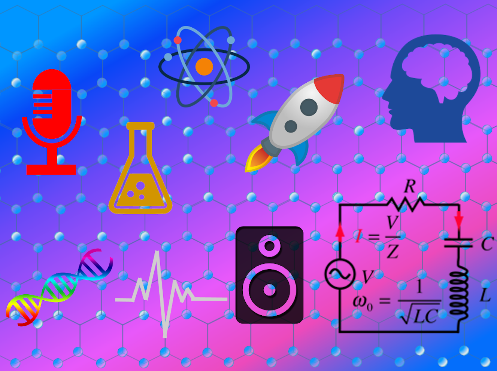

<html>
	<head>
		<meta charset="UTF-8" />
		<meta name="viewport" content="width=device-width, initial-scale=1, maximum-scale=1, user-scalable=no" />
		<meta http-equiv="X-UA-Compatible" content="IE=edge" />

		<title>Digital Health Applications</title>
	</head>
	<body>
	

	

			<h1>Digital Health Applications</h1>
	

	
	
<a href="./">Home</a>
	&nbsp;&nbsp;
	<a href="./latest.html">Apps</a>
	&nbsp;&nbsp;
	<a href="./tutoring.html">Tutoring</a>
	&nbsp;&nbsp;
	<a href="./about.html">About</a>
	&nbsp;&nbsp;
	<a href="./latest_blog.html">Blog</a>
	&nbsp;&nbsp;
	<a href="./contactInfo.html">Contact</a>

	
	

	
  			
  			
<small>&#169; 2021 Peter S. Popolo</small>

	

	

			<h2>Obtaining the Basic Science Background You Need To Become an Allied-Health Practitioner</h2>
	

Students preparing for traditional STEM college programs such as engineering, microbiology, or pre-med will typically follow a rigorous path to obtain the prerequisite math and science background for their chosen careers. Students choosing to go into the allied-health fields, however, such as physical therapy, occupational therapy, speech-language pathology, nutrition, radiography, massage therapy, and osteopathy, may not always follow a similar path leading up to college or professional program admission. For anyone who is interested in becoming an allied-health practitioner, obtaining a basic science background is an essential part of career preparation. As a first step, consider taking advantage of the many educational resources available through the various media that are a part of our daily lives. Just a few examples are: documentaries and series such as "NOVA" and "Nature;" the journals <i>Science</i> and <i>Nature</i>; YouTube channels such as “Physics Girl” and "Crash Course Physics" (as well as other Crash Course channels); a myriad of science blogs on the web; and popular, non-fiction scientific literature, such as the books by Oliver Sacks and Stephen Hawking, just to name a few. If you choose to go the reading route, don’t overlook the importance of engaging in critical reading. For instance, don’t let your eyes glaze over equations; instead substitute the full names of the parameters for the symbols as you read them, and state the relationships as words; for example, "Acceleration is directly proportional to  force and inversly proportional to mass" (<b><i>F</i></b>  = <i>m</i> * <b><i>a</i></b>) . Also, don't skip over new vocabulary words, but turn each encounter with an unfamiliar term into a learning opportunity by, you guessed it, “googling” it! There are just so many ways to incorporate learning into everyday experiences.

<a href="mailto:peterpopolo@gmail.com?subject=Contact">Contact</a> me today and let's turn YOUR app idea into reality in as little as 5 weeks!

<a href="./blog_3.html">Back to Top</a>

  
<small>&#169; 2021 Peter S. Popolo. All rights reserved.</small>

