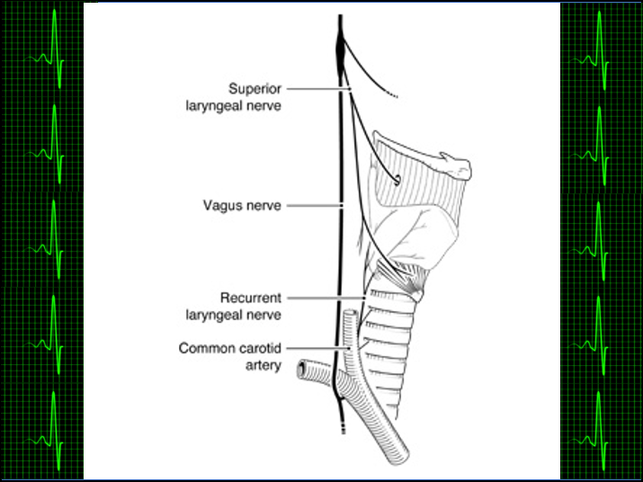

<html>
	<head>
		<meta charset="UTF-8" />
		<meta name="viewport" content="width=device-width, initial-scale=1, maximum-scale=1, user-scalable=no" />
		<meta http-equiv="X-UA-Compatible" content="IE=edge" />

		<title>Digital Health Applications</title>
	</head>
	<body>
	

	

			<h1>Digital Health Applications</h1>
	

	
	
<a href="./">Home</a>
	&nbsp;&nbsp;
	<a href="./latest.html">Apps</a>
	&nbsp;&nbsp;
	<a href="./tutoring.html">Tutoring</a>
	&nbsp;&nbsp;
	<a href="./about.html">About</a>
	&nbsp;&nbsp;
	<a href="./latest_blog.html">Blog</a>
	&nbsp;&nbsp;
	<a href="./contactInfo.html">Contact</a>

	
	

	
  			
  			
<small>From: Titze, I.R., "Principles of Voice Production," 2000</small>

	

	

			<h2>The Voice-Body Connection</h2>
	

Hoarseness caused by damage to the Recurrent Laryngeal Nerve (RLN) due to cardio-vascular causes, known as Ortner’s Syndrome or cardio-vocal syndrome, is a rare albeit fascinating condition  (to me, anyway) that serves to illustrate the voice-body connection in medicine and health. The RLN is one of the main branches of CN X (i.e., Cranial Nerve 10), a.k.a. the Vagus nerve, the other branch being the Superior Laryngeal Nerve (SLN). The RLN descends from the branch point and runs between the aorta and pulmonary artery, before it courses back up to the larynx (or “voice box”) where it controls almost all laryngeal musculature and is responsible for protection of the airway. According to a mobilehealthnews.com article from November 2016, ”Researchers at the Mayo Clinic believe that there may be a relationship between voice characteristics and heart disease, meaning that doctors might someday use voice-analyzing software as a non-invasive, complementary diagnostic tool.” I find this topic fascinating, as I mentioned before, for just this reason: if the eyes are the window to the soul, as the old adage says, then the voice is the music by which the finely tuned instrument of our body can be characterized, and which contains an amazing wealth of information about the hidden workings of our body. I eagerly anticipate that scientists and physicians will continue to discover new and exciting ways to use voice analysis algorithms to provide clues in diagnosing disease and help promote health and wellness.

<a href="mailto:peterpopolo@gmail.com?subject=Contact">Contact</a> me today and let's turn YOUR app idea into reality in as little as 5 weeks!

<a href="./blog_5.html">Back to Top</a>

  
<small>&#169; 2021 Peter S. Popolo. All rights reserved.</small>

