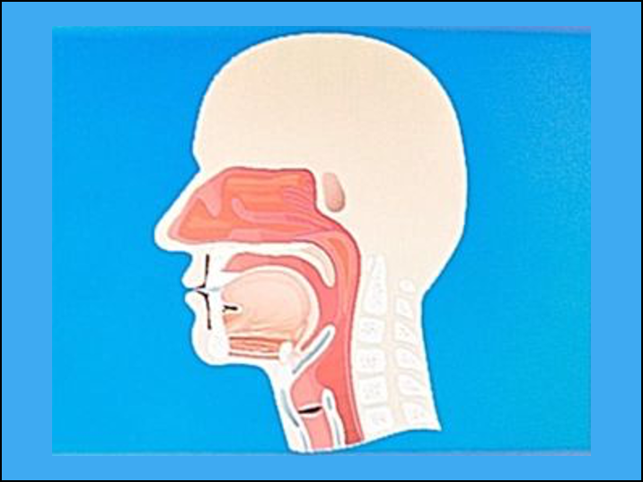

<html>
	<head>
		<meta charset="UTF-8" />
		<meta name="viewport" content="width=device-width, initial-scale=1, maximum-scale=1, user-scalable=no" />
		<meta http-equiv="X-UA-Compatible" content="IE=edge" />

		<title>Digital Health Applications</title>
	</head>
	<body>
	

	

			<h1>Digital Health Applications</h1>
	

	
	
<a href="./">Home</a>
	&nbsp;&nbsp;
	<a href="./latest.html">Apps</a>
	&nbsp;&nbsp;
	<a href="./tutoring.html">Tutoring</a>
	&nbsp;&nbsp;
	<a href="./about.html">About</a>
	&nbsp;&nbsp;
	<a href="./latest_blog.html">Blog</a>
	&nbsp;&nbsp;
	<a href="./contactInfo.html">Contact</a>

	
	

	
  			
			
<small></small>

	

	

			<h2>A Little Voice Science For When You're Feeling Under the Weather</h2>
	

Pardon me while I divert the focus of this blog from digital health apps to voice science for a moment...

“Achy”, “scratchy”, “in my bones” - all ways to describe the vague feeling of discomfort arising from the back of your throat. It is vague and familiar at the same time, and even the affected area is difficult to accurately describe - “throat”, a word which in fact is more of a physical description of a tapered area, has a number of different names, ranging from <i>gola</I> in Italian (as in the singing style of <i>gola aperta</i> attributed to Garcia) to "gullet" (as in the part of a chicken) to “anterior neck”, the anatomical region where the thyroid cartilage of the larynx, or “voice box”, resides. As a singer I can definitely relate to having a heightened awareness of that part of our body and wanting to be proactive when something feels “off.” Our nasopharynx is a very sensitive area where the nasal tract, vocal tract, and hearing system all come together, and it’s sitting right over the entrance to our digestive system, the upper esophagus. Needless to say, functionally it’s a very complex area, and subject to feelings of “referred sensation.” That achy feeling of something in your throat, like a “pill that’s stuck” (or <i>globus</i>, in medicalese) could very well be the beginning of a minor ear or sinus infection, or possibly a cold, which is clinically described as an “upper respiratory infection” or URI. For many of us singers in church choirs, it’s a yearly occurrence right around March or April that coincides with the Lenten and Easter season, culminating in what I call my very own “Easter Triduum” of hoarseness on Holy Thursday, near voicelessness on Good Friday, and miraculous recovery on Easter Sunday. So when you first get that uneasy feeling, the best thing you can do is to see your primary care physician, who can learn all they need to know by looking in your throat with a flashlight and a tongue depressor, and in your ears with an otoscope. Unfortunately, it’s an area we absolutely can’t look at ourselves because of our anatomy, but your PCP will be able to assess it quite easily. If it is some kind of infection, your doctor will be able to prescribe the right medicine for you, and if it's something more serious your doctor can then refer you to an otorhinolaryngologist, a.k.a an ear-nose-and-throat doctor. Most times, however, that visit to your doctor will be enough to confirm it’s time for Ricola cough drops, Throat Coat&#169; herbal remedy tea, and some plain old voice rest between choir rehearsals and performances (yet another Easter Triduum). Good luck with the yearly Spring cold season, and if you do get a cold I hope you get over it soon!

<a href="mailto:peterpopolo@gmail.com?subject=Contact">Contact</a> me today and let's turn YOUR app idea into reality in as little as 5 weeks!

<a href="./blog_6.html">Back to Top</a>

  
<small>&#169; 2021 Peter S. Popolo. All rights reserved.</small>

