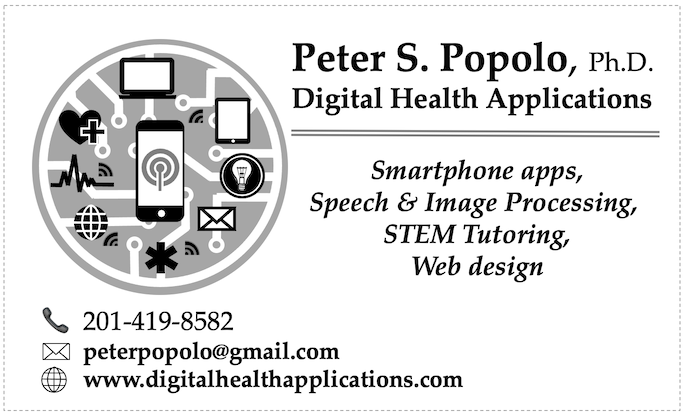

<html>
	<head>
		<meta charset="UTF-8" />
		<meta name="viewport" content="width=device-width, initial-scale=1, maximum-scale=1, user-scalable=no" />
		<meta http-equiv="X-UA-Compatible" content="IE=edge" />

		<title>Digital Health Applications</title>
	</head>
	<body>

	

			<h1>Digital Health Applications</h1>
	

	
	
<a href="./">Home</a>
	&nbsp;&nbsp;
	<a href="./latest.html">Latest Apps</a>
	&nbsp;&nbsp;
	<a href="./about.html">About</a>
	&nbsp;&nbsp;
	<a href="https://www.researchgate.net/profile/Peter_Popolo/research" target="_blank">Research</a>
	&nbsp;&nbsp;
	<a href="./contactInfo.html">Contact</a>

	
	

				
	

	

			<h2>Contact Digitalhealthapplications.com about your custom app requirements today!</h2>
	

TO: Digitalhealthapplications.com

FROM: Your email address goes here

SUBJECT: Request a quote

YES! I would like to get a quote from Digitalhealthapplications.com to create a custom app for my research project. Let's set up a day and time to discuss my specific needs and requirements.

Send email to <a href="mailto:peterpopolo@gmail.com?subject=Request a quote&body=YES! I would like to get a quote from Digitalhealthapplications.com to create a custom app for my research project. Let's set up a day and time to discuss my specific needs and requirements."> Peter S. Popolo</a>

	
<a href="./">Home</a>

